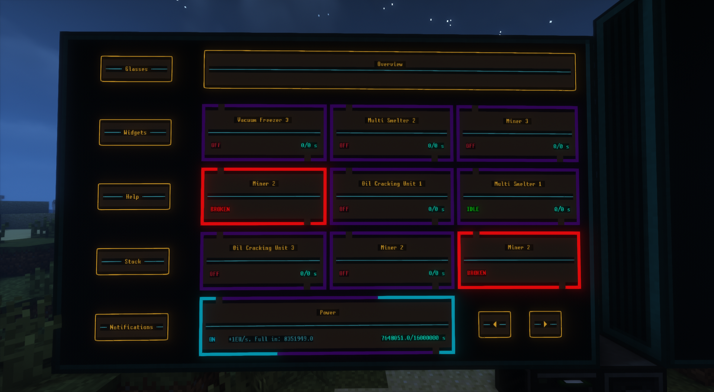

# InfOS
A collection of OpenComputers code for automated information gathering, displaying and automation.

This was made to be used in the Gregtech: New Horizons modpack, but you can use it as you please.

For better developing and debbuging, I sugest installing OCEmu.

## A fork of Sampsa's InfOS

### This fork contains monitor-system, a program to
- Monitor power and machine states and display them in nifty little widgets on an OpenComputers screen,
- Configure and display widgets on OpenGlasses2 HUD,
- Display holograms in then world to aid the player in finding the machine that needs maintenance,
- Disable machines that require a cleanroom when it is not at 100% efficiency,
- Notify about important events in one's base, such as power loss or need for maintenance,
- Work somewhat nice with shaders

### Screenshot

